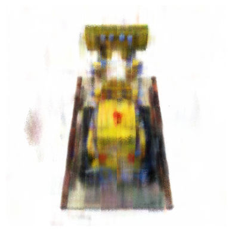
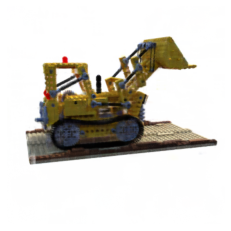
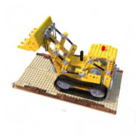

```markdown
# KiloNeRF: Speeding up Neural Radiance Fields with Thousands of Tiny MLPs

Implementation in 100 lines of code of the paper [KiloNeRF: Speeding up Neural Radiance Fields with Thousands of Tiny MLPs](https://arxiv.org/abs/2103.13744).

## Usage

### Prerequisites

- Python 3.10.10 ([Download here](https://www.python.org/downloads/release/python-31010/))
- PyTorch with CUDA support

### Dataset
[Download the training and testing datasets](https://drive.google.com/drive/folders/18bwm-RiHETRCS5yD9G00seFIcrJHIvD-?usp=sharing)

### Installation

1. Install PyTorch with CUDA:
```bash
pip install torch==1.12.0+cu116 torchvision==0.13.0+cu116 torchaudio==0.12.0 --extra-index-url https://download.pytorch.org/whl/cu116
```

2. Install other requirements:
```bash
pip install -r requirements.txt
```

### Running the Code

1. Train and save the model:
```bash
python kilo_nerf_saving_model.py
```

2. Test the trained model:
```bash
python kilo_nerf_test.py
```

## Results

### Novel views rendered from the optimized models

|  |  |
|:-------------------------:|:-------------------------:|
|  |  |

## What is not implemented

- Training with distillation
- Occupancy grid
- Custom cuda kernels

---

**Note:** This is not my original implementation! I just fixed some errors and added the model saving feature.  
Source: [MaximeVandegar/Papers-in-100-Lines-of-Code](https://github.com/MaximeVandegar/Papers-in-100-Lines-of-Code/tree/main/KiloNeRF_Speeding_up_Neural_Radiance_Fields_with_Thousands_of_Tiny_MLPs)
```
